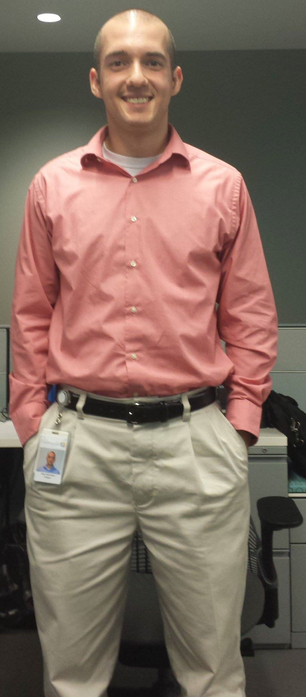

---
---

<link rel="stylesheet" href="styles.css" type="text/css">

I am a Data Engineer turned Data Scientist.  I spent the first years of my career working mostly in SQL, Python, Talend, and relational databases building automated data pipelines to feed reporting and dashboard platforms with some analysis on the side.  Now that I have transitioned to Data Science, my focus has shifted from building data to figuring out ways I can leverage data to help support business goals through data analysis and machine learning.

I am currently pursuing a Masters in Data Science from the University of Illinois at Urbana-Champaign.

My full CV is available [here](files/AlexAntonison_Resume.pdf).